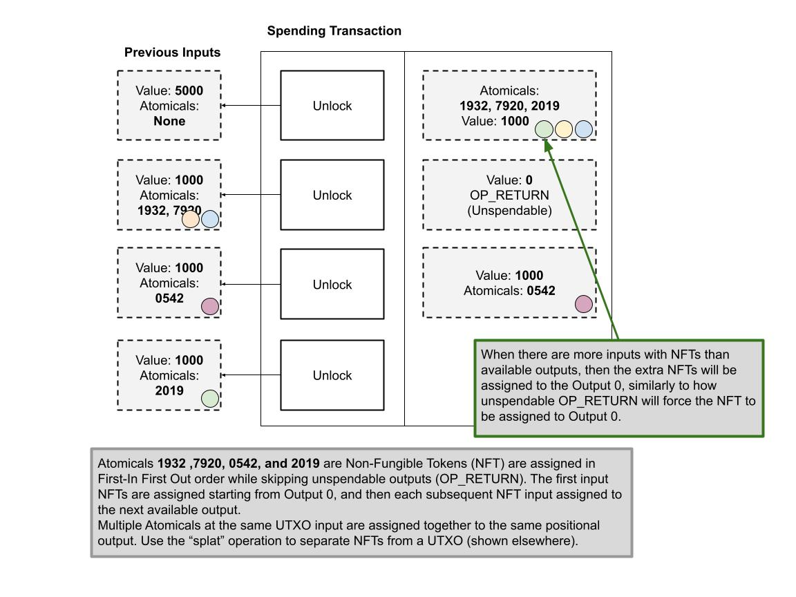

# 普通转移规则

了解 Atomicals 非同质化代币（NFT）的转移规则

对于领域（Realms）和容器（Containers）等 NFT 的常规操作，采用了从输入到输出的先进先出（FIFO）分配机制。这意味着，包含 NFT 的最早输入会被分配给第一个可用的输出，随后的输入依次分配给接下来的输出，直至所有的输入中的 NFT 都得到分配。如果预期的输出是一个不可消费的 `OP_RETURN`，或输出数量不足以容纳所有输入中的 NFT，则 NFT 默认分配到第 0 个输出。

## 非同质化代币（NFT）的转移规则

NFT 在输入中按先进先出的顺序进行分配。如果一个输入中包含多个 NFT，这些 NFT 被视为处于相同的位置，并会一同被分配到相同的输出中。

