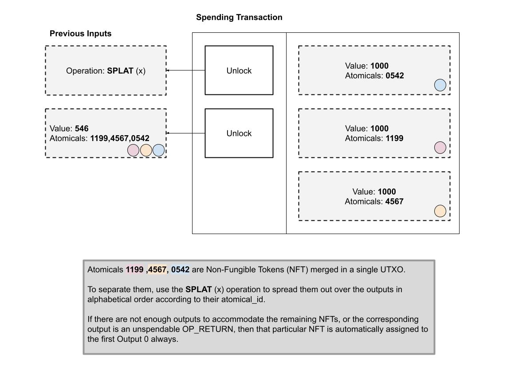

# 拆分操作

在一些情况下，多个 NFT 可能会被合并在同一个 UTXO 中。通过使用 `SPLAT(x)` 操作，可以在一个交易中将这些 NFT 分离（或“拆分”）到它们各自的输出中。

**示例：**

假设非同质化代币（NFT）Atomicals 1199、4567、0542 合并存储在单个 UTXO 中。

为了将它们分离，可以采用 `SPLAT(x)` 操作，并根据它们的 `atomical_id` 将它们按照字母顺序分配到不同的输出中。

如果没有足够的输出来容纳所有的 NFT，或者特定的输出是不可消费的 `OP_RETURN`，那么在这种情况下，特定的 NFT 将默认分配到第 0 个输出。

