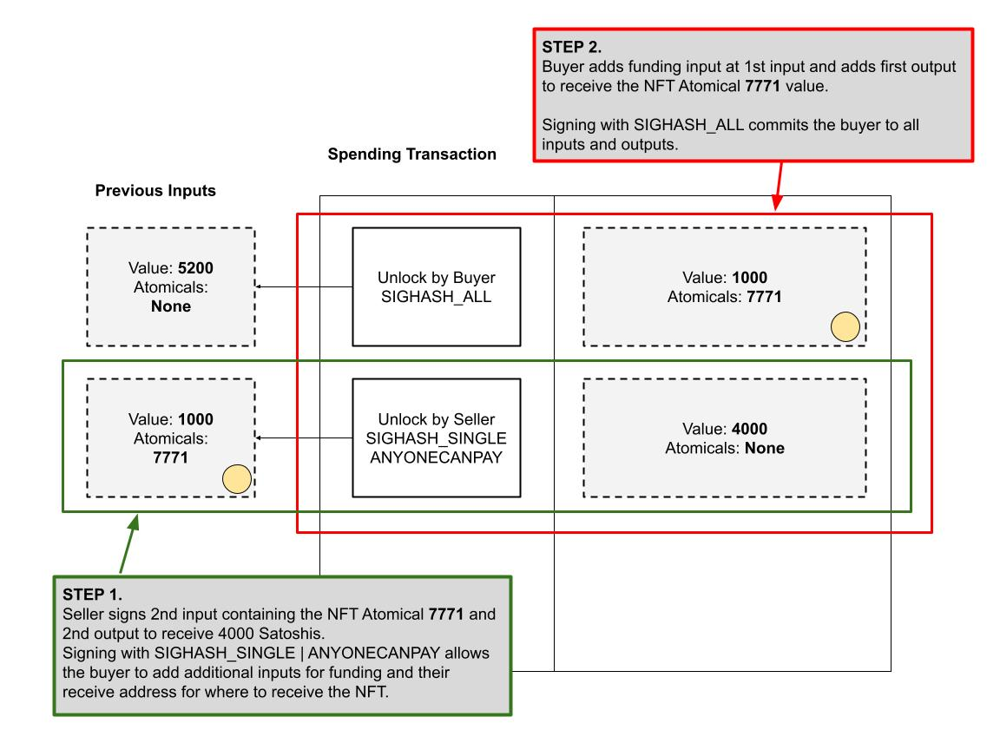

# 交换转移规则

了解 Atomicals 非同质化代币（NFT）PSBT 交换规则

**第一步：**

卖方为包含 NFT Atomical 7771 的第二个输入以及用于接收 4,000 聪的第二个输出签名。通过使用 `SIGHASH_SINGLE | ANYONECANPAY` 签名哈希类型（Signature Hash Type），这允许买方增加额外的输入来提供资金，并指定接收 NFT 的地址。

**第二步：**

买方在第一个输入位置增加资金，并设置第一个输出，以此来支付 ARC20 Atomical 7771 的价值。买方使用 `SIGHASH_ALL` 签名哈希类型（Signature Hash Type）对交易的所有输入和输出进行签名，从而确保对交易的完整性负责。

