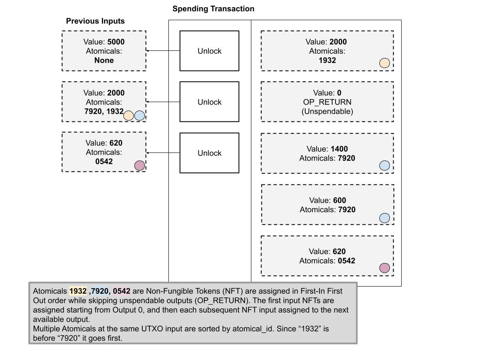
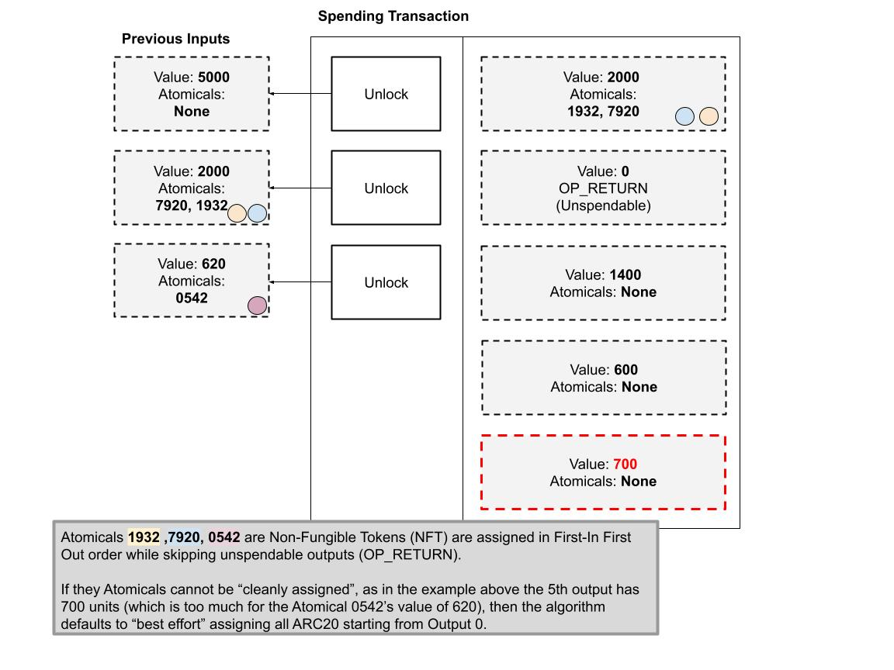
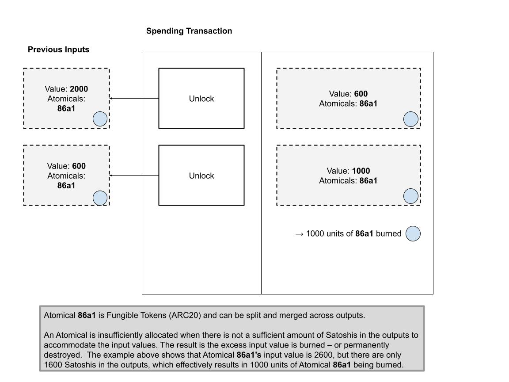
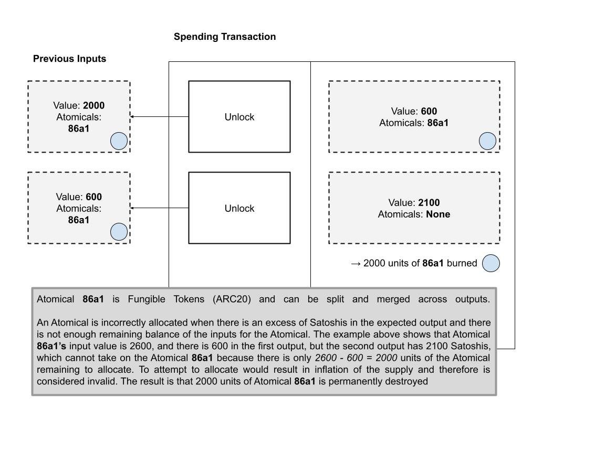

# 普通转移规则

了解 Atomicals 同质化代币（ARC20）的转移规则：

在正常的ARC20代币转移操作中，所有输入中代币的总量应该被完全且明确地分配给输出。如果输出不足以承载所有的输入代币，或者任何后续的输出会导致代币数量的超发（即代币单位的膨胀），那么剩余的代币将会被永久地销毁或燃烧掉。

## 同质化代币（ARC20）的转移

完全分配 - 所有输入根据先进先出规则明确地分配给输出。

Atomicals 1932、7920、0542 是非同质化代币（NFT），它们根据先进先出规则进行分配，同时绕过不可消费的输出（OP_RETURN）。第一个输入中的 NFT 从输出 0 开始分配，随后每个接下来的 NFT 输入都被分配给下一个可用的输出。位于同一 UTXO 输入中的多个 Atomicals 会根据它们的 `atomical_id` 进行排序。由于“1932”在“7920”之前，因此它会被优先分配。

完全分配 - 所有输入根据先进先出规则明确地分配给输出。

## 同质化代币（ARC20）的转移

未完全分配 - 从输出 0 开始执行“尽可能多”的分配。

在无法完全分配所有 ARC20 代币的情况下，算法将尽可能地从输出 0 开始进行分配，不考虑是否已经分配了其他 ARC20 代币。这种做法旨在为开发者或钱包可能未能追踪到多个输入中的 ARC20 代币提供一种宽容机制——换言之，它尝试尽可能地进行补偿和分配。

Atomicals 1932、7920、0542 是非同质化代币（NFT），它们根据先进先出原则进行分配，并绕过不可消费的输出（OP_RETURN）。

在未能“清晰地分配” Atomicals 的情况下，如若某个输出（比如上述示例中的第 5 个输出）的单位数（此处是 700）超出了某个 Atomical（如Atomical 0542）的价值（此处是 620），算法则默认从输出 0 开始尽可能多地分配所有 ARC20 代币。

## 同质化代币（ARC20）的转移

输出不足时会导致未分配的单位被永久销毁

Atomical 86a1 作为一种同质化代币（ARC20），其单位可以在不同的输出之间进行拆分和合并。

若输出中可用的聪数量不足以完全容纳输入中的代币量，则会出现 Atomical 分配不足的情况。这种情况下，超出部分的输入代币将会被燃烧——即永久性销毁。例如，在上述情景中，Atomical 86a1 的输入总量为 2,600 单位，但输出总量仅为 1,600 聪，导致 1,000 单位的 Atomical 86a1 被燃烧掉。

## 同质化代币（ARC20）的转移

过度分配不当 - 剩余部分将被永久销毁

Atomical 86a1 作为同质化代币（ARC20），其单位可以在不同的输出之间进行拆分和合并。

如果预期的输出中聪的数量过多，导致输入的剩余余额不足以覆盖 Atomical 的需求，这种情况下的 Atomical 分配将被视为不正确。在上述情况中，Atomical 86a1的输入总量为2,600 单位，第一个输出分配了 600 单位，但第二个输出尝试分配 2,100 单位，这是不可行的，因为此时只剩下 2,000 单位的 Atomical 需要分配（2600 - 600 = 2000）。任何超出的尝试分配都将导致供应膨胀，因而被认为是无效的。因此，剩余的 2,000 单位 Atomical 86a1 将被永久销毁。

