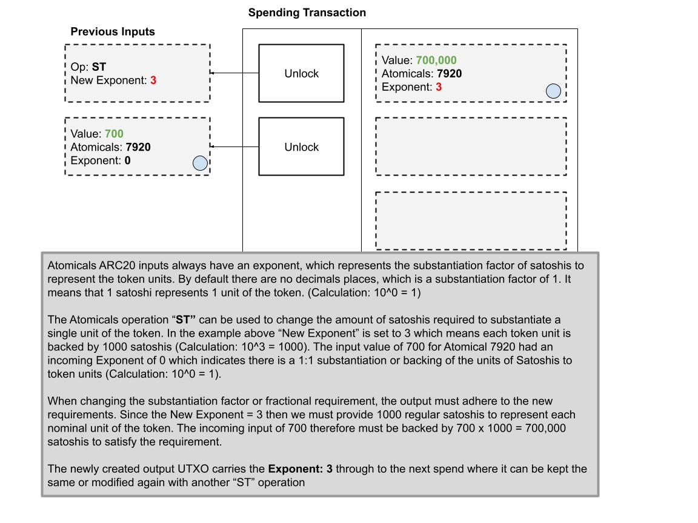
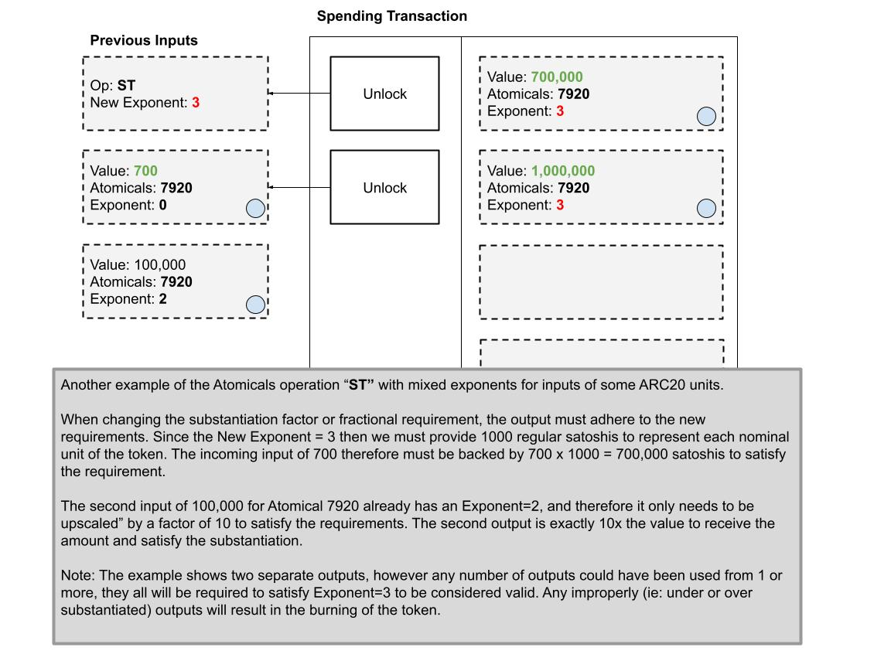
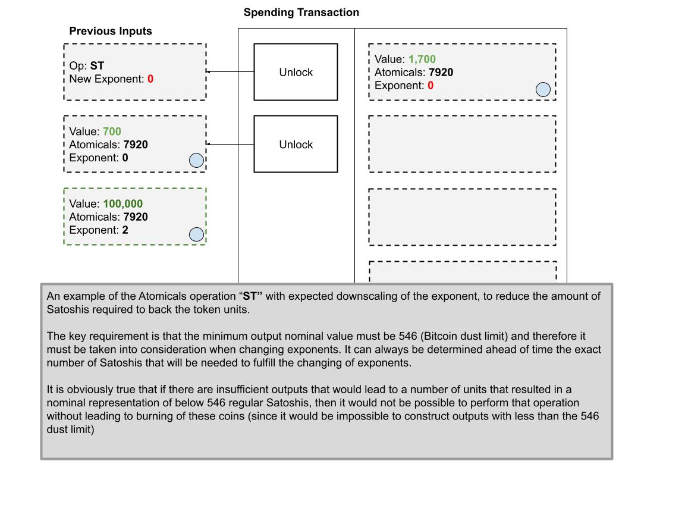
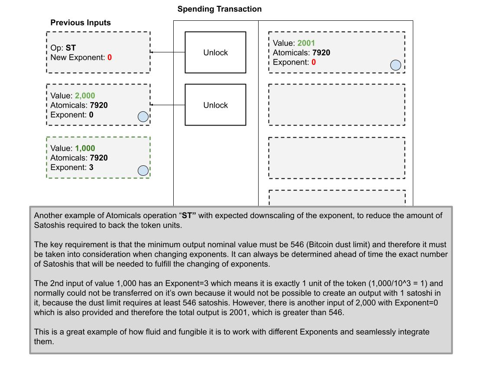
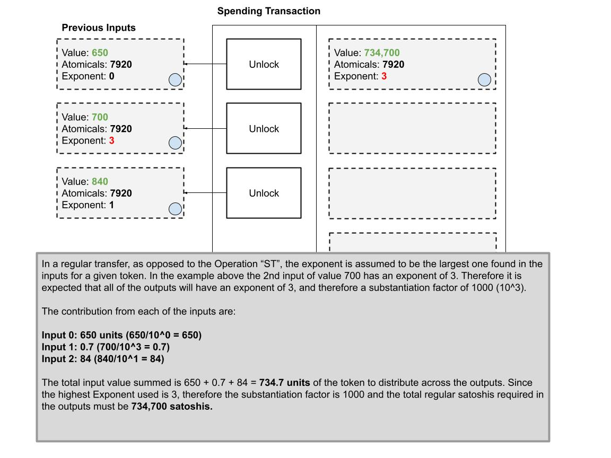

# 实质化因子

这个想法目前仅停留在概念阶段，尚未付诸实践。

问题在于，由于比特币的粉尘限制，单个 UTXO 无法传输少于 546 聪，这意味着也无法以少于 546 的单位数转移 ARC20 代币。这一限制可能对许多用户和应用程序构成不可接受的障碍。

:::tip

⚡ 解决方案：通过引入一个名为实质化因子（Substantiation Factor，SF）的概念，重新定义每个 ARC20 代币单位所需的聪数量。默认的实质化因子设定为 1:1，需要实现任意精度，以便支持转移少于 546 个单位的代币。

:::

## 操作：“ST” - 实质化代币

引入了一种新的操作，使得可以将代币单位的实质化比例从 1:1 调整至1:10、1:100 等不同级别。这一操作实质上允许代币持有者将他们的代币单位“分割”或“分数化”至任意精度——前提是他们必须根据所需比例提供相应数量的聪作为代币单位的担保或支撑。

ARC20代币的默认实质化比例为 0 个小数位，即 1:1。这可以理解为 10 的 0 次方等于 1，即指数为 0。

接下来，通过改变指数来引入小数位，我们便能够用不同的倍数来“调整”或“重新定义”代币的实质化比例。

可以设想一个指数表来展示以 1:1 比例支撑的代币单位，随后是 1:10、1:100 聪等级别。

```plain showLineNumbers
10^0 = 1
10^1 = 10
10^2 = 100
10^3 = 1,000
10^4 = 10,000
10^5 = 100,000
```

例如，假设我们想要交易 1 单位的代币，同时遵循比特币的粉尘限制。我们可以通过用 1,000 个标准聪来实质化每个代币单位，从而允许执行 1,000 聪的转移，相应的指数为 3。

下面的示例将展示这种方法如何保持 ARC20 转移的可替代性和流动性，同时实现上述操作。



在处理具有不同指数的多个输入时，这一过程同样可以轻松应对：



这里提供一个将指数“降级”至更低级别的示例：



再举一个例子，以便更清晰地解释这一概念：



## 在不使用操作“ST”的情况下转移

如果不采用“ST”操作，则直接使用最高指数作为目标指数，就是这么简单。


