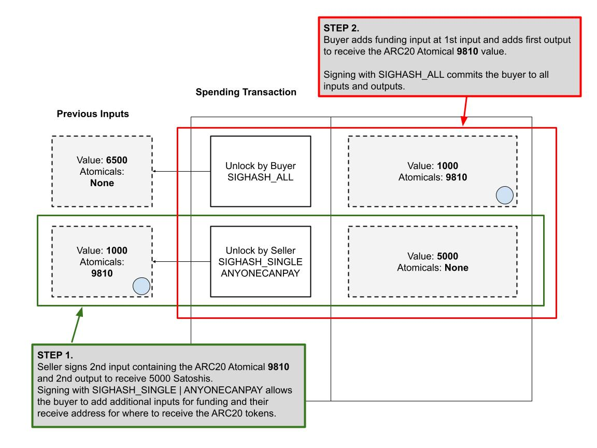

# 交换转移规则

了解 Atomicals 同质化代币（ARC20）的 PBST 交换规则：

**第一步：**

卖方签署含有 ARC20 Atomical 9810 的第二个输入，并为接收 5,000 聪而签署第二个输出。采用 `SIGHASH_SINGLE | ANYONECANPAY` 签名方式，以便买方能够添加额外的资金输入以及他们用于接收 ARC20 代币的地址。

**第二步：**

买方在第一个输入位置添加资金，并设置第一个输出用以接收 ARC20 Atomical 9810 的价值。买方使用 `SIGHASH_ALL` 签名方式，从而对交易中的所有输入和输出负责。

