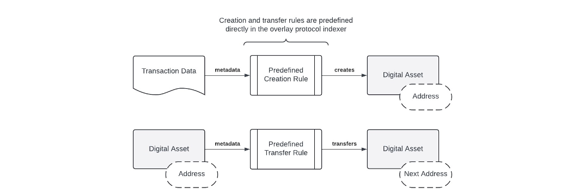
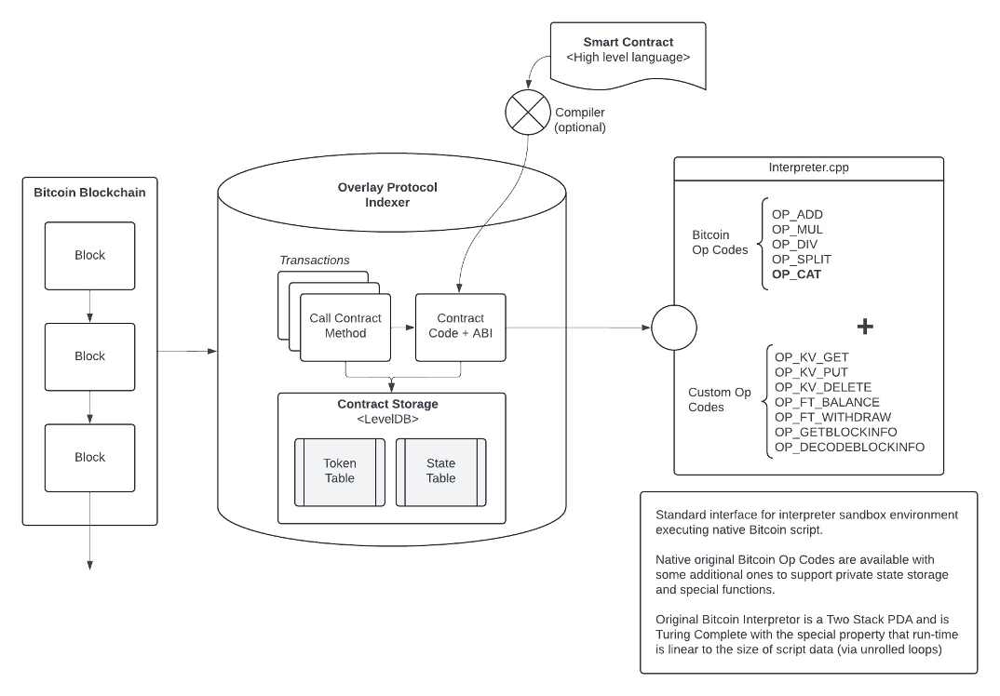

# AVM 白皮书

通过模拟比特币虚拟机在比特币上实现智能合约。[转载自 [Wizz Wallet](https://docs.wizz.cash/wizz-wallet/v/zh/avm-bai-pi-shu-zhong-wen-ban) 的中文翻译]

:::info

原文链接：https://github.com/atomicals/avm-whitepaper/blob/main/avm.md

:::

## 摘要

到目前为止，比特币上所有的叠加数字资产协议均依照固定规则来创建和转移数字资产。通过允许程序员定义状态机逻辑来创建和管理这些规则，我们可以为叠加数字资产制定完全灵活的（图灵完备的）智能合约。我们提出了一种解决方案，将比特币作为全球数据库使用，将智能合约代码存储在交易中，并在沙盒环境中通过叠加数字资产索引器执行这些代码。原始比特币脚本操作码指令集被采用作为编程语言，因其具备在资源有限的环境中高效执行的所有必要属性。状态哈希用来追踪叠加交易，并为参与者提供一种方便的方式来验证他们的同步状态。我们提出的这个解决方案是比特币叠加数字资产协议自然演进的一步，同时也是测试原始比特币操作码的平台，展示其灵活性和安全性。

## 1. 引言

比特币点对点电子现金系统[1]最初主要被用作价值存储，因此被称为“数字黄金”，而作为交换媒介的功能则较为次要。在中本聪离开之前，他出于安全考虑，特别是为了避免潜在的拒绝服务攻击，禁用了许多用于高级脚本编写的原始操作码（Op Codes）。这些被禁用的操作码主要包括算术和二进制操作，这些都是开发人员在最基本的编程环境中所依赖的基础操作。没有这些关键操作码的支持，比特币的应用开发人员和最终用户的可用功能非常有限。特别是“OP_CAT”（数据连接）操作码，它本可以用来创建自定义的消费和转移约束，即所谓的契约。因此，由于这些历史性的决策，比特币未能成为中本聪最初设想的强大智能合约平台，而只能作为一种数字黄金存在。简而言之，由于这些关键操作码的禁用，比特币不得不仅仅作为数字黄金存在，无法发展成完整的智能合约系统，以此来保护这个新兴的电子现金系统。

> “比特币的本质在于，一旦0.1版本被发布，其核心设计便在其生命周期内被固定下来。正因如此，我打算设计它能够支持我能想到的所有交易类型。问题是，每一种交易类型都需要特别的支持代码和数据字段，不管这些是否被使用，每次只能处理一种特定情形。这就可能导致特殊情形的过多膨胀。脚本提供了一种解决方案，它将问题进行泛化，使得交易双方可以将他们的交易描述为一个由节点网络来评估的谓词。” ——中本聪[2]

自从比特币首次禁用部分操作码以来，已引入了多种保护措施。其中一个重要的限制是 MAX_SIGOPS，它限制了任何特定交易中允许的最大签名操作次数。通过回顾历史，我们可以观察到这些原始操作码在比特币的分叉版本如BCH和BSV中的表现；这些分叉几年前重新激活了大多数原始操作码。到目前为止，这些操作码并未引发任何安全问题或拒绝服务攻击，也几乎没有引起任何争议。相反，它们极大地拓展了这些比特币分叉的开发潜力。

尽管比特币智能合约目前存在限制，但已经出现了一些允许在比特币本身上创建和转移数字资产的叠加协议。第一个主流的非同质化代币标准是称为Ordinals的协议，紧接着推出了一种同质化代币标准BRC20。此后不久，涌现出了更多其他数字资产协议，例如Atomicals数字对象和ARC20，后者利用satoshi单位作为账户单位，以及Bitcoin Stamp和最近的Runes同质化代币协议（2024年4月发布）。这一代叠加协议基本上通过比特币交易来创建和管理数字资产，而叠加协议索引器则通过直接从特殊的比特币交易中读取数据来追踪和管理数字资产的生命周期。这些协议中缺少的是开发人员自定义数字资产行为的能力——直到现在，还没有一种方法能为这些叠加协议创造高级智能合约。

我们提出了一种通过模拟比特币虚拟机及其脚本解释器来为各类叠加数字资产创建和执行智能合约的方法。在这种方法中，比特币区块链不仅为链上存储的智能合约程序提供时间戳和数据，同时，这些程序的执行也通过各种叠加协议索引器在一个沙盒环境中进行。叠加协议索引器节点由应用程序开发者、服务提供者和用户共同管理，共同形成了一种自发的共识。这一概念及其技术可广泛适用于所有叠加协议，只需要针对各自的叠加协议索引器作适当调整即可。

我们展示了原始比特币设计的力量与优雅。这种新的范式可作为测试各种操作码的平台——尽管它是针对数字资产叠加协议的——我们希望比特币最终能够重新启用所有原始操作码，从而释放中本聪创造的最大潜力。

## 2. 比特币作为全球数据库

比特币网络本质上是为解决双重支付问题而设计的分布式时间戳服务器。系统的设计不仅适用于货币交易的传输和存储，还可以用于存储发票、大型文件等数据。中本聪包括了各种操作码，如OP_RETURN，允许附加任意数据，以及OP_PUSHDATA4，允许数据推送高达4GB。甚至第一笔比特币交易——创世币基交易——也包括了任意文本数据：“The Times 03/Jan/2009 Chancellor on brink of second bailout for banks”。

多年来，人们一再尝试通过将最大推送大小限制为520字节，并将OP_RETURN的使用限制在40字节（后来扩展到80字节）来阻止比特币被用作数据存储介质。确实，这曾被视为一种可能导致“区块链膨胀”失控、挤占纯货币用途的攻击向量。这在当时看似是一种合理的保护措施。

近年来，比特币开发者通过引入隔离见证（SegWit）和Taproot升级，有效地重新引入了早期比特币版本类似的大量任意数据存储能力。应用开发者迅速利用这一机会，利用比特币作为不可变的全球账本来存储有价值的数据。比特币上的数字资产市场呈现出指数级增长，市值达到数十亿美元，并在相对较短的时间内为矿工创造了数亿美元的网络费用。

## 3. 叠加协议

哈尔·芬尼（Hal Finney）提出并预测了利用比特币作为全球化、去中心化、一致性数据库来支持“叠加其他协议”的概念。这一基本思想涉及到通过信号传递来创建叠加资产，并将这些资产与特定的交易历史相关联。这一机制为比特币作为货币系统增添了新的维度，即交易输出本身可以代表任何其他类型的数字资产，如代币、积分、数字媒体，甚至是物理资产的代理权。

> “在BitDNS线程的讨论中，我提出了一个将其他协议叠加到比特币上的想法。从某种角度来看，比特币是一个全球性的、去中心化的、但又保持一致性的数据库。
>
> 这个数据库主要用于记录硬币的转移，但它也可以用于更多其他用途。许多应用程序可以从一个全球一致的数据库中受益。根据我对BitDNS的描述，这一机制将通过使用一种神秘且复杂的“脚本”系统向常规比特币交易中添加额外的数据来实现。这些数据对当前的客户端而言会显示为NOP（无操作指令）并被忽略，但是叠加协议感知的客户端会检查这些NOP块内的额外数据，并根据叠加协议进行解释。
>
> 具体来说，我可以想象使用OP_NOP1来标记叠加数据，然后使用OP_PUSHDATA来推送特定数据，接着使用OP_DROP将数据从栈中移除，最后执行常规的交易操作码。这对常规客户端没有任何影响，看起来就像是一笔普通的交易（可以是一笔虚拟交易，例如自己转给自己0.01比特币），但是能够识别叠加协议的代码会识别出这是一笔协议交易。
>
> 例如，比特币可以用作一种廉价的时间戳服务，允许您证明某个文档在某个特定日期之前已经存在。您需要做的只是创建一笔虚拟交易给自己，并修改客户端来执行一个OP_PUSHDATA操作，将文档的哈希值推送进去，然后用OP_DROP将其从栈中移除。这个哈希值将永久存在于区块链中，并作为该文档在那个日期存在的证据。” ——哈尔·芬尼[3]

首个获得广泛应用的叠加协议是Ordinals理论。根据Ordinals手册的描述，单个satoshi可以刻录任意内容，创建出独特的比特币原生数字工件。这些工件既耐用、不可变、安全，又去中心化，可以保存在比特币钱包中，并通过比特币交易进行转移。

紧随其后的2023年，开发者们认识到比特币上需要一个同质化代币标准，于是便开发出了BRC20。BRC20借助Ordinals理论建立了一个与钱包地址相关联的叠加账户模型，使其能够发送和接收代币单位，实际上是在Ordinals的基础上创建了一个分层的叠加协议，而Ordinals本身就是一种基于比特币的叠加协议。

到了2024年初，又出现了一个名为Atomicals协议数字对象的新协议，以应对代币标准和索引技术市场的持续增长。如Atomicals指南所述，Atomicals协议是一个简单但灵活的协议，适用于在使用未花费交易输出（UTXO）的区块链（如比特币）上铸造、转移和更新数字对象（通常称为非同质化代币）。Atomical（或“原子”）是按照一些简单规则组织数字所有权链的方式。Atomicals协议还包括了一个名为ARC20的同质化代币标准，每个代币单位至少由一个satoshi单位支持，并且使用与比特币本身同样的UTXO架构操作。

2024年稍晚时候，另一个名为Runes的叠加协议被发布，它直接在Ordinals索引器中实施，以完善Ordinals理论的功能，最终也包括了一个同质化代币标准。

## 4. 状态机

到目前为止，比特币上所有的叠加协议都是基于固定或预定义的状态机运行的。这些叠加协议共有两个主要组成部分：一是负责信号传递以创建数字资产，二是管理这些数字资产转移的规则。这些状态机规则被硬编码在各自的叠加协议索引器中，开发者无法自定义创建或转移规则。

我们提出了一种动态的状态机编程模型，允许开发者完全自主地定义其数字资产的创建和转移规则。这本质上使开发者能够定义自己的元叠加协议规则，而无需创建新的协议索引器，而是可以利用现有的叠加协议索引器。

基本思想是允许开发者将其智能合约代码存储在区块链上，使所有参与方都可以读取和解释。通过将代码存储在链上，可以确保在分布式且不相连的各方中以相同的方式执行逻辑，从而方便状态的同步。智能合约编程语言应具备以下几个重要属性：

- 确定性和可预测的运行时间。

- 允许任意的灵活性（图灵完备性）[4]。

- 以及能在资源受限的系统上高效运行。

从这些要求可以看出，比特币脚本非常适合用作定义数字资产创建和转移规则的指令集。关键在于它需要支持任何类型的状态转换，同时限制执行时间以防止服务拒绝攻击和程序无限循环。比特币脚本是图灵完备的，它是一个双栈下推自动机（2-Stack PDA），由于使用了循环展开技术，不允许循环，因此具有运行时间可预测且与程序长度成线性关系的特点。

智能合约程序代码被存储在比特币交易中，叠加协议索引器将代码加载到内存中并一致地执行。所有相关方可以执行相同的逻辑，并达到相同的状态转换。

## 5. 状态共识

状态的同步可以通过状态哈希（statehash）实现，这一机制将叠加协议索引器的内部状态传递给外部观察者。通过公开状态哈希，分布式的各方可以轻松判断他们是否遵循相同的规则并且是否彼此同步。

由于所有数据都存储在链上并按时间顺序加上时间戳，因此不需要复杂的状态承诺同步机制。这使得任何人都可以在遵循相同规则的前提下，得出一致的状态结果。

## 6. 虚拟数字资产

任何叠加协议都可以采用这种动态状态机编程技术，允许数字资产在智能合约中进行虚拟化和实体化。本质上，这意味着我们可以将存款和提款的概念视为一种约定，因为其他所有事物都是基于区块链上完整的交易历史记录来构建索引器状态的约定。

在BRC20中，代币余额是账户的抽象表示，可以被描述为一种虚拟数字资产——即在另一种数字资产（比特币）之上的数字资产。Atomicals ARC20代币是保持与底层satoshi单位的亲和力的抽象，但它们同样也是一种虚拟数字资产。更准确地说，它们被称为“虚拟数字资产”，因为它们的存在是在另一种数字资产（比特币）之上的一个抽象。

为了创建虚拟的基于账户的抽象层，我们可以定义一个状态机，它允许接受任何类型的代币存入合约，并且之后可以取出，类似于以太坊区块链的Solidity编程语言允许方法被标注为可支付（payable），表示可以向该方法支付以太币，并根据智能合约程序的规则之后取回。这些数字资产的跟踪和管理可以通过特殊的操作码，如OP_FT_WITHDRAW和OP_NFT_WITHDRAW，以及一个允许智能合约状态中的可支付方法接受代币的机制来完成。

基于账户的抽象化构建，我们可以定义一种受保护的智能合约内存，只能由合约本身写入。回想一下，Atomicals 数字对象已经提供了用于非同质代币的通用键值存储，我们可以定义一个只能通过特殊的键值存取操作码如OP_KV_GET、OP_KV_EXISTS、OP_KV_DELETE和OP_KV_PUT来进行检索、确认存在、删除和写入的内存空间。这种存储技术使得比特币上的智能合约在功能上与以太坊区块链相当。

我们提出了一种全新的架构方法，称为虚拟UTXO（vUTXO）架构。该架构严格遵循交易输出的消费链条，通过将每个输出与一个特定的锁定脚本绑定，这些锁定脚本只能通过提供相应的有效解锁脚本来解锁。这一机制在覆盖协议的索引器中创建了一个虚拟的UTXO集，从而为虚拟数字资产的开发者摆脱了比特币矿工提供的有限指令集的约束，赋予了极大的自由度。然而，关键的挑战是必须设置有效的过期时间、更新策略和清理策略，以处理过时的vUTXO，防止覆盖协议索引器的状态膨胀过大。

## 7. 系统架构

为确保脚本的一致性执行，脚本解释器被设置在一个具有静态或动态绑定、边界明确的沙盒环境中。这种设置使得不同的编程语言和环境能够调用沙盒并获得一致的结果，从而确保执行的一致性。

沙盒解释器是一个简化版的比特币脚本解释器，它在一些关键方面有所不同，例如它可以直接接受执行锁定脚本（scriptPubKey）和解锁脚本参数（scriptSig），以及其他一些有助于虚拟数字资产管理的有用参数。这些设计的目的是简化和加强虚拟数字资产的处理和管理，使得它们可以更高效、更安全地在比特币网络上操作。

## 8. 结论

我们提出了一种系统，通过模拟比特币虚拟机来在比特币上实现叠加数字资产的智能合约。迄今为止，比特币上的叠加数字资产完全受制于预定义的状态转换规则，这些规则只允许这些资产的创建和转移。为了解决这个局限性，我们开发了一种通用技术，将比特币作为全球数据库，将智能合约代码存储在交易中，并在叠加数字资产索引器的沙盒运行时环境中执行这些代码。

原始的比特币脚本指令集非常强大，因为它实现了一个双栈下推自动机（2-Stack PDA），已被证明具有图灵完备性。我们的系统使用状态哈希，使得所有参与者都可以轻松地验证他们的索引器状态是否正确地同步。这个系统的设计非常灵活，不仅是现有叠加协议的自然扩展，还展示了原始比特币脚本语言的巨大潜力。这种方法为比特币生态系统内的叠加协议提供了更高级的功能，使其能够支持更复杂的智能合约应用。

## 参考文献

[1] Satoshi Nakamoto, "Bitcoin: A Peer-to-Peer Electronic Cash System" https://bitcoin.org/bitcoin.pdf, 2008.

[2] Satoshi Nakamoto, "The nature of Bitcoin is such that once version 0.1 was released, the core design was set in stone for the rest of its lifetime...", https://satoshi.nakamotoinstitute.org/posts/bitcointalk/126/, 2010.

[3] Hal Finney, "In discussion on the BitDNS thread I came up with an idea for overlaying other protocols onto Bitcoin...", https://bitcointalk.org/index.php?topic=2077.msg26888, 2010.

[4] Wikipedia contributors. "Turing completeness." Wikipedia, The Free Encyclopedia. Wikipedia, The Free Encyclopedia, https://en.wikipedia.org/wiki/Turing_completeness, 2024

## 致谢

以下名单和留言是为了感谢所有支持者。参与者只需自愿提交自己的名字或留言。这是我们向每位支持者表达感激之情的方式，将他们的支持永久铭记。

支持者名单（无特定顺序）：

Concord, Massachusetts

shadow: keep building

Thomas PEACE: 5cd8002820ab74f299911ab2d613d54430d419723bae475ea2b8c876709416ed (sha256 of "Look Mom I'm on Bitcoin")

芭比金刚: 我们共同见证，崭新的加密时代. 我们和atomicals站在一起

El1contreras

DateDiver: Decentralization and community unity. We will build together on the protocol and make history within the Bitcoin blockchain.⚛️

+kuniter: Long Live Atomicals

Wizz: Coloring The Bitcoin, Programming The Future

ArlynsCryptoTrader: No existe valor mas importante que la Libertad - There is no value more important than Freedom

josephbm_btc: Muy contento y agradecido por ser parte de este proyecto deseo muchos éxitos en todo lo que hagan bendiciones

nicolasgpcr

bejar

julianbb

ZZQ: Web3 world will remember what's we achieved. Love you all my family.

Andrés Quiros Valverde

Anonymous: Ξthos ₿ : no race, no skin, only love

Howe: Best wishes to Atomicals and always believe it will make a revolution in the BTC ecosystem.

AlexV525

Anonymous: EVO will be a dynasty

FireKun: DAOs will be the building blocks of future human civilization. The Realm Name system is the best platform for creating DAOs. Thanks to Atomicals, Bitcoin is great again!

灰太狼吉哥Nakamoto: If you don't believe me or don't get it, I don't have time to try to convince you, sorry.

Disco Quotidie: live w/ bitcoin

CESARDATA: MAMÁ LO LOGRÉ!

DragonCapsule loves Atomicals

Dennis@MetaFoxes

CripVtor: Manuel desde El Salvador: La libertad no tiene precio, el desarrollo de la AVM marca un antes y un después en Blockchain

KIANG: Atomical protocol ha llegado a colorear un mundo centralizado y monocromático

money3315: Atomicals is a great invention! I firmly believe that it can go further and grow taller! Good luck to us!

Anonymous: 大山梦

Zhang Q

+atomshuttle

+web3er

see222: 道阻且长，行则将至

see111: 不啻微茫，造炬成阳

木子: 功不唐捐，玉汝于成

阿科: 浮生若梦，为欢几何

陈陈: 荜路蓝缕，栉节沐风

小白菜: 大音希声，大象无形

Anonymous: 温柔半两，从容一生

Anonymous: 乾坤未定，你我皆是黑马

Anonymous: 工贵其久，业贵其专

Anonymous: 坚持不懈，终将成功

Anonymous: 勇敢追梦，无所畏惧

Anonymous: 信心是成功的关键

Anonymous: 踏上征程，追寻光明

Anonymous: 梦想是行动的起点

Anonymous: 坚持与激情，点燃希望之火

Anonymous: 无畏前行，成就梦想

Anonymous: 勇敢迈出第一步，未来即刻展开

Anonymous: 每一次的尝试都是通向成功的桥梁

Anonymous: 希望是前行的动力，坚持是抵达目的地的关键

Anonymous: 创业之路不止于目的地，更在于沿途的风景

Anonymous: 困难不是终点，而是通往成功的必经之路

Anonymous: 行动胜过一切，梦想因行动而生

Anonymous: 挑战是成长的阶梯，勇气是攀登的力量

Anonymous: 成功的种子，播种于不断努力的土壤

Anonymous: 明日之花，源自今日的耕耘

Anonymous: 不放弃，不止步，前行的路上皆是希望

Anonymous: 创业路上，每一步都在接近成功的彼岸

Anonymous: 我诚 路自稳.

Anonymous: 山高路远 只看自己.

Anonymous: 做野花 做千千万万.

Anonymous: 不讨好不迎合不够讨喜但自由.

Anonymous: 我爱舒服的晚风自由的灵魂.

Anonymous: 路上见识自己 途中认清自己.

Anonymous: 无心风月 独钟自己.

Anonymous: 若无共呜 沉默即安.

Anonymous: 先自沉稳 而后爱人.

Anonymous: 泛交不如独往

Anonymous: 做自己的灯塔

Anonymous: 边清零边拥有

Anonymous: 越山 阅书悦己

Anonymous: 偏见是无知的产物

Anonymous: 关注内心 远离喧嚣

Anonymous: 做让人远远听见的风

Anonymous: 步伐一致的人不会走散

Anonymous: 知足知不足 有为有不为

Anonymous: 欲成大树 莫与草争

Anonymous: 别听建议 听听自己

Anonymous: 心静则淡泊 不争则宽松

Anonymous: Build A Vibrant Metaverse on Bitcoin，原神启动⚛️

Manupe: AVM, This is the way

Kash: Atomicals on top.

songkan: 有格局的项目方

innocente.eth: Congratulations AVM

Anonymous: ATOMICAL IS BITCOIN'S FUTURE. COME ON.

Anonymous: Atomicals，请再次伟大

D10S

POWERFEI

cyber牛

BridgeHoleCap: Hello,Atomicals

haifeng: 因为相信，所以看见!

Jackie: we are with you

Anonymous: Empty your minds,Be formless shapeless, like water. Water can flow or it can crash, be water,it is very slow and you push it out, running water never grow stale. All the time you are keeping the continuity going.

April: like water

Skyler

a16886

Sixologist: Make Bitcoin great again!

fly_higher: salute to Idealism / 向理想主义致敬

ChaseCalleja

Arren亚刃: Atom changes the world and my life

voyager_zh: Make Atomicals Great Again!

tiedyedmt

F.F: Make Bitcoin Great Again

AndyJiang: I love ATOM

Alp2a: Make Atomicals Great Again!

DannftTc: keep going！！ LFG ！！

misscryptochen: always supports magic Atomicals!

cybex888

+blueark: Can't wait for AVM to launch and shake up the ecosystem! Let's do this!

SuperL9

Blueee: Hopefully something more interesting will happen.

freeusa.eth: Always support Atomicals ⚛️

ChengGong: For atomicals, For builders!

Yixin

btcdayu-hpk: Atomical will be very hot fast!

lxcong.eth: make bitcoin great again

tang430

wiki: will make Bitcoin and the Atomicals protocol great again! Let's build the BIT civilization together!

0xMatsu: Make colored coin great again!

Ghezzi

Peter Logan: New Era

taooz1: AVM UP！

ffromer: 希望ARC20做大做强，为比特生态做出更大的贡献

LaPLoD: 衷心祝愿atomicals协议能够成功，也祝福一切理想主义者能够成功。 best wishes to atomicals protocol and all idealist

lorryxiong: Realize Satoshi Nakamoto's vision

aimierbear

Web3英语每日一句

luoran

blockpunk2077

NextDAO: NextDAO 🤝 Atomicals

Anonymous: 理想主义者终将取得胜利✌️

BoxMrChen and Collider: Make Atomicals Greate Again!

猫弟: Atomicals 是普通人最值得参与的比特币生态，没有之一

bandeng917

Kumata: For the future.

fishermengz

pinetworks.eth: atomicals is the best protocol of the 21st century

0xSea.eth: Make Bitcoin Great Again.

oz: Groundbreaking work has not only set a new benchmark but also inspires a future filled with limitless possibilities. Congratulations on this monumental achievement.

atomtoothy: we will always support Atomicals ⚛️

Allin0543: All IN ATOMICALS

+yon: Make Bitcoin Great Again.

+falcon: Atomicals, Quark, LFG!

PigBlockchain: 高老庄

phekda: God bless idealists.

+ivanoror: Thanks for everything.

0xFish

Xingkong.sats

Kika Wang: this is my ice cream money, for something cool

julian: mfer

gaohongxiang: Love Atomicals! Love AVM!

GanRy.x: 有意思比有意义本身更有意义.

Kar1kar1: Long live Atomicals

jessecai33: Make BTC Turing Complete

0xsimon: The road not taken makes all the difference.

Mr.Zhang: Atomicals grow at light speed!

0xshowhandism

suntoshi: Many hands make light work. WAGMI

SJTU trm: difference is value

yan: 我们的贡献，如同河流汇入大海，虽微不足道，却是不可或缺的一部分。每一份支持，都在推动着人类社会向前发展，证明了我们对技术进步的坚定信念。愿我的小小努力，能够汇聚成推动世界前行的力量。

MonicaSchm55590: 比特币让中华文化焕新生,Bitcoin makes Chinese culture great again.

0xwuming

sharp

taro: 遨游九霄

XBTC2008: Atomical Bombs are sparking a major explosion in BTC world.

0xMatsu: Make colored coin great again!

奈斯: love atomicals.

江天霸: 历史上伟大的瞬间如同天上的繁星，而我们有幸化身为其中一颗，共同在宇宙的画卷上留下独特的轨迹。

0xNoVoice: Looking!The blitz loop this planet to search way.Only my Atomicals can shoot it.

Adolfo Cz: Oro Atomico

snow of pluto: 比特币是一个自我实现的预言。Make Bitcoin magical again !

Xinyue Zhang

Sixologist: Make Bitcoin great again!

Chevy: Marico ya tu viste lo que esta haciendo

Krito: I love Atomicals

silencezq: 肝

0xfish

laobo: The crypto world is the greatest innovation and it’s fascinating

xiaobai

渣渣

Gouer: Support Atomicals LFG

石头: 再次让比特币光芒万丈

lzz96

Terrific: 8888

Gagus: 1974第一次在东南亚打自由搏击就获得了冠军…

Long

btctian

0xJeremy: avm can definitely create miracles!

ash: Atomicals will be immortal with Bitcoin.

+dragon: I love AVM

+snake: Make BTC great again!

brandontruely: petit à petit, l'oiseau fait son nid.

痴大飞: I LOVE CT.

QuarksLand: Welcome to Quarks Land! Make Atomicals great again!

bravo_6688: make atomicals immortal

诺米: you know what M3

DannylovesDoris: In Atomicals we trust!

ocram857

Zach

EHMJ: may god bless me to be rich

lake: hello_world_hello_avm

clickbinary: NOTHING BUT RICH

DJ: quark It’s about time!

BTC2035: AVM is BEST

DAVTYAN ARA

DDD: IKUZO 衝 冲

spaceline

tanz: The end of infinity is a new beginning.

Fairy Mo: Fairy Mo doesn't care

marcjoe

barra

mikey: 价值有边际，模因无上限

小球

撸噜子『華文道』: 比特币让中华文化焕新生,Bitcoin makes Chinese culture great again.

maybe7093948

AmyWang: Bring Bitcoin to the next level，原神启动⚛️

blurmaggie: keep building!

守得云开见月明: Just do it and make Atomicals better and better -berry

QuarkToDaMoon: No1 meme coin in BTC ecosystem

Sankin: I think one token for one sats and bitwork are the most attractive features of the Atomicals protocol.

Dreworld

0xshushu

haiyu

胡翌霖『華文道』: 比特币让中华文化焕新生,Bitcoin makes Chinese culture great again.

Tanshui: Everything is becoming interesting; the 'singularity' of the Bitcoin ecosystem has emerged.

Fernando torrico mariscal: thanks to be real all the time.!!!!

dynamox: believe in something

Thread: AVM makes BTC great again

ckw: 原子协议一统天下

+csrf: Lezhi+Emma+CSRF^_^

Leaper: This time, we are truly witnessing the ultimate innovation on Bitcoin—Atomicals are the answer to everything.

Joel Bodden: Living the Satoshi Nakamoto's Dream and be part of History of The AVM

MrVinPH, CPA: Contributing to Atomicals Protocol for the advancement of bitcoin and future success!

bitsky738: Love and Peace

老飘

Kuncle: Brother Han, is it really impossible to become an immortal cultivator without a spiritual root?

Teng: AVM unlocks infinite possibilities.

守得云开见月明: Go Big or Go Home—Berry

infinity: AVM makes Atomicals Protocol great!

Mosqu1to: The Atomicals protocol will change the world, so do I.

Jony He: 希望#Atomicals成为比特链上最主流的协议，为币圈打开聪的世界,最终实现万链归一. #Atomicals Protocol ⚛️ will make Bitcoin great again 05/26/2024

曼巴肘击

korou: Freedom and fairness are a movement, Bitcoin is the future!

Hernan H: Ser parte de esto es hermoso.

YIDASHI: 26.5.2024:daochiyiyou

Nahuel Pumari: Thanks to my family, Nicolas, Laura, Jorge, I love you.

KitoShi: no dejes de vivir por miedo a morir.

ahmed alsayadi

H.H: El brillo de los colmillos sobre las escamas de las gran serpiente... D10s existe y es atómico.

Coinwar: Unete a epicas batallas

Jaime: Success is not final, failure is not fatal: It is the courage to continue that counts

XEUG: Idealist,rock forever,102LDCB!

TommyDavis: Viva la Atomicals

Rudy.H: Pour toi mon fils JULIAN.H Tu es la plus belle chose qui me soit arrivée sur cette terre chaque moment avec toi est un cadeau précieux. Que la force, le courage et l'honneur soit dans ton coeur mon fils. Je t'aime. PAPA MERCI AVM

vico: 天之道，损有余而补不足。

you jianzuo: Smart contract on BTC coming.

xsh: AVM makes Bitcoin greater.

lanxinr: Bitcoin and AVM will drive the world towards greater fairness, transparency, and freedom.

chirsj: congrats to come to the real world

siriusye: Mastering Satoshi-level manipulation is essential for Bitcoin's success. Atomicals will further enhance Bitcoin's potential. We are poised to witness an exciting future.

Nucleus

Karo Espiritu: Building for the future of cryptos.

Manuel Gómez

Franky: Nadie conoce qué nos deparará el futuro y poder enfrentarnos a él de forma exitosa puede resultarnos complicado en determinadas ocasiones.viva la libertad carajooo.

hehaifeng: Because of belief, one sees.

Erol Bodden: Expendiendo el universo de Bitcóin.

+Kelin: Atom makes BTC truly great!

+MrBWG: Great Bitcoin,Great Atomicals!

+kamen: Thanks Atomicals for contributing to the BTC ecosystem and changing my life.

kiroashi: nanmubagayalu

Peng Xia: Xiaoju Wang and Ruilin Xia，I love you forever!

Swee: Buy Bitcoin, own future.

wanghao

lushuguang: Lu Yi and Wang Hongfen are in good health and live long lives

李寒寅: web3 to the moon

Lu Qun, Yuan Yuqi: Yuan Xinyao finds a good job and marries a good wife

ele_crypto: Developing is improving the growth of any project

Daniel Rodriguez: I'm very happy to participate in this project, I'm from Argentina. VLLC!

Agustín Rodríguez: I believe in this project! Love you guys from Argentina

阿蒙: 祝愿一切都顺利

Terrific:1691888

Flybull

Neo188: To Be Healthy & Wealthy!

姓名：给年轻人一个机会

Banana: World is a frozen banana.

云鹏

Liberty Cats

Wanning: Freedom

Stone: Let Bitcoin shine again

Jianing: Bitcoin is Forever.

rengoku.sats/+rengoku: Set your heart ablaze.

0xrodger: Atomicals will open up a new world for Bitcoin

Techjoy: The future belongs to the crypto. And the Bitcoin ecosystem will play an important role in the future.

STRICH Gauthier: Merci pour cette révolution ⚛️

Lorry Xiong: To make bitcoin a world computer

DINGJIANZHONG: 100408220923

Zhining: Love and Peace

北方: ATOM使BTC变得更伟大、更完善。

Dailos, a Canario from '82 who was at the birth of one of the greatest milestones of humanity ARC-20, I love Ana, the best mother in the world, without you nothing would have been possible, Thank you.

Tanz: Love Rice and Tammy forever and infinitely.

Kambo: I love my family, With Atomicals Protocol ,BTC will more greater!

苏苏: 为自由而战

ChengGong: Wishing Atomicals all the best for the future.

Less-23 huguesib: Bitcoin is complete. thanks to atomicals.

rupertgy: At this moment, you are witnessing history, the creator of miracles, Atomicals！ If you don't believe it, I don't have time to explain

liangaonb: Atomicals makes bitcoin great again!

Le Sauveur: D'une une vision éclairée qui mérite la plus haute admiration, à des perspectives inestimables pour Bitcoin et au-delà.

to1dev: Bitcoin is our homeland!

LaMachina: Thank you, for your dedication and ingenuity. Atomicals brings the color that Bitcoin was lacking to fully realize its potential. We are witnessing a remarkable advancement that will undoubtedly leave a lasting mark on the history of the timechain. Thank you immensely.

Ehook: Blockbeats

AnyNodes: Building a Decentralized World

Estyven García Zapata: AVM mi llave a la libertad!

石榴园_曙光村小学

chuqian: 人生得意须尽欢，莫使金樽空对月。天生我材必有用，千金散尽还复来。

MLRDKZT: All my admiration and gratitude for his ingenuity and diligence. They say we dream in color. Now, we Bitcoin in color. Thanks.

Tedchang112: Atomicals will be the most popular FT protocol on Bitcoin!!!

fanzj: Believe Atomicals !

Florent: From the Atom to the Infinity

Peng Xia: Xiaoju Wang and Ruilin Xia，I love you forever!

承彦: 让虚拟货币生态再次伟大

撸噜子『華文道』: 比特币让中华文化焕新生,Bitcoin makes Chinese culture great again.

nicrain: Salute to the developers with ideals and capabilities, the world is different because of you!

大头: 原子协议让比特币更伟大

PengPeng: My love: Beryl,Mia and Bitcoin!

zhx295023: Make Atomicals Greate Again!

crazy4answer: Let's make the history

Mian_

老东: Atomicals fight till the end

Zoe Wang

+Crypto CY: Together We Build History

x.闻: 原子协议——永远伟大，永远热泪盈眶

Otomo_Sai@NextDAO

stopstopgogo: BTC OG

风筝: wish for better

李子建

EddieWen89: Atomicals will lead the crypto world

axu: Pay tribute to the great blockchain decentralization spirit,atomicals

LIYU: Always be optimistic, always stay positive and upward

Valody: 海市蜃楼虽幻境，乘风破浪仍向前(Although the mirage is illusory, it is still moving forward in the wind and waves.)

dayhon

出头之日: 2024Arc20带我自由飞翔！

海蜇: Make Bitcoin Great Again.

Hercules__Bg: The beginning.

_cyberkaiser: Thank you
