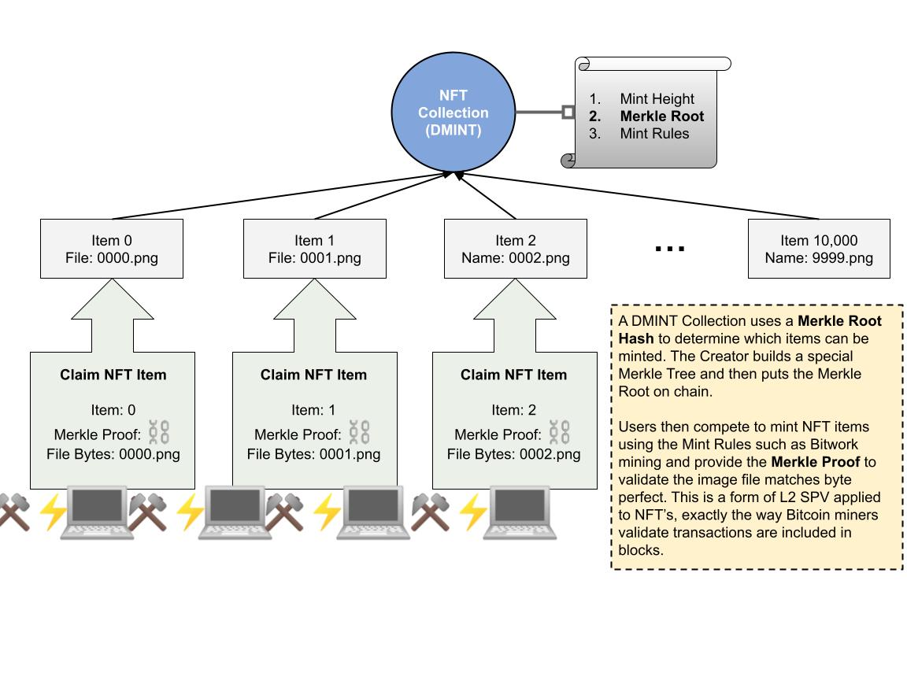

# DMINT 指南

Atomicals NFT 容器 DMint 教程

:::info

本 DMINT 指南由 [wizz.cash](https://wizz.cash/) 团队提供并编写。点击查看[原文链接](https://astrox.notion.site/Atomicals-NFT-Container-DMint-Tutorial-1bd9216f051942458b3a83268a68fb0c)。

:::



## 术语

| 词汇      | 解释      |
|---------|----------|
| Mint   | 指在区块链上创建新内容的过程，通常包括在区块链上生成和记录新项目。 |
| DMINT  | “去中心化铸造”，一种无需中心化机构介入的铸造操作方式。 |
| Container | 指一组 NFT 项目的集合体。 |
| Bitwork | 指铸造操作的难度级别。关于 Bitwork 的更多官方信息可在[此处](../bitwork-mining)查询。 |
| Timestamp | 时间戳通常表示自某个固定起点（例如Unix纪元开始的1970年1月1日00:00:00 UTC）至今的秒数或毫秒数。 |

## 概览

本教程旨在向 NFT 项目所有者详细解释如何将他们的 DMINT NFT 集合整合到 Atomicals 协议中。在 Atomicals 协议里，NFT集合被称作“容器”，这与通常所说的“NFT集合”大体上是相同的概念。

整个流程主要分为四个步骤：

1. 准备集合所需的全部数据。
2. 设置容器。
3. 对 NFT 项目进行验证。
4. 铸造 NFT 项目。

作为项目所有者，您应专注于前三个步骤。

:::tip

💰 每一步操作之前的 ⛓️ 图标意味着该操作将在区块链上执行，可能会产生一定的矿工费用（Gas费）。

:::

### 准备集合数据

1. 汇集所有NFT的相关数据（例如A1, A2......AN）。
2. 为您的集合编制 DMINT 所需的数据（B）。
3. 收集集合所需的其他元数据信息（C）。
4. 利用命令行工具创建一个新的本地钱包，用以隔离所有与容器相关的操作，以防混淆。

### 配置容器

1. ⛓️ 铸造容器。
2. ⛓️ 利用集合数据（B）来设置 DMINT。
3. ⛓️ 配置其他元数据（C）。
4. ⛓️ 在核对所有信息无误后，对容器进行封存。（最终步骤！确保一切正确无误后进行！）

### 验证 NFT 项目

1. 在您已经拥有项目数据并且容器已在链上通过 DMINT 进行配置的情况下，可以单独利用 NFT 数据（A）来验证项目是否与容器相匹配。
2. 一旦容器被封存，您就能查询到单个项目的铸造状态以及已铸造项目的列表。

### 铸造 NFT 项目

1. ⛓️ 下载 NFT 数据（A）并利用官方提供的命令行工具进行本地铸造。

:::warning

📌 为了帮助您区分各种文件，我们使用了大写英文字母进行标注。请务必在执行各个步骤时留意对应的文件标记。使用错误的文件可能会导致链上数据发生不预期的问题。

:::

从上述步骤中可见，项目所有者无需单独将每个 NFT 上传至区块链。用户需要自行验证并承担铸造过程中的矿工费用。

## 操作流程

本操作指南基于 atomicals-js 命令行工具的 0.1.46 版本（[提交记录aa34095c](https://github.com/atomicals/atomicals-js/commit/aa34095c673de28166105e26ab2e898179e8039a)）。请注意，该工具的版本可能会定期进行更新，所以在开始之前，请确保您使用的是最新版或兼容版的命令行工具。有关安装和配置的更多信息，请参见：[命令行工具官方文档](https://github.com/atomicals/atomicals-js#install)。如果您对某个特定命令有疑问，可以在执行命令时加上 `-h` 选项来查看帮助信息。

:::tip

💡 为了确保操作流程顺利，无意外发生，强烈建议您在主网执行任何操作之前，先在测试网上进行全面测试。

:::

:::tip

❗ 在步骤说明中，任何包含 `#container-name` 的地方都应替换为您的容器名称，且容器名称需要以 `#` 符号开头。如果没有遵循这一规则，某些命令可能无法将其正确识别为Atomicals 容器。

:::

:::tip

💰 在带有 `--satsbyte` 选项的命令中，请根据当前链上矿工费的情况来设定适当的数值。（提示：可以参考[mempool.space](https://mempool.space/)以获取实时数据）

:::

### 准备集合数据

1. 创建一个文件夹，用于存放所有原始 NFT 文件（如图片）。建议提前更改文件名（例如，把 `number.png` 改成 `1234.png`），以减少后期需要进行数据修改的可能性和复杂性。文件名仅支持数字、英文字母和连字符（`-`），不能以连字符开头，且长度不得超过 64 个字符。
2. 执行命令以为所有 NFT 生成处理后的数据。操作完成后，将会创建一个包含处理结果的新文件夹。

```bash showLineNumbers
yarn cli prepare-dmint-items "path/to/collection-folder" "path/to/output-folder"
```

3. 生成的文件夹将被命名为 `output-folder`，后面跟随一个时间戳，内部包含每个 NFT 的独立 `item-*.json` 文件。这些文件目前仅包含 `mainHash` 和 `data` 字段。如有需要，您可以通过 `args` 参数指定 `bitworkc/bitworkr`，这样在用户进行铸造操作时，将需要满足指定的 bitwork 难度。

```json showLineNumbers
{
  "mainHash": "0099ad5961eff12096b851d9701bedfe09ec3433dad89857bcaddc5ea2172c98",
  "data": {
    "args": {
      "request_dmitem": "test-1",
      "main": "image.jpg",
      "i": true
    },
    "image.jpg": {
      "$b": "ffd8ffe000104a4649460001010100600060000ffd9"
    }
  }
}
```

4. 使用以下命令来生成 DMINT 数据。将 `path/to/folder` 更改为第二步中生成的文件夹的路径，并将 `mintHeight` 替换为铸造操作的起始区块高度（推荐使用 `0`，这意味着一旦部署，铸造操作即可开始）。操作完成后，文件夹中将新增一个名为 `dmint-timestamp.json` 的文件，其中包含所有 NFT 的更新后的处理数据。

```bash showLineNumbers
yarn cli prepare-dmint "path/to/folder" 0 "b1d0"
```

```json showLineNumbers
{
  "dmint": {
    "v": "1",
    "mint_height": 0,
    "merkle": "5c529dacfb37fc24804c550abc851602a9926016a424390387eb23e38de4cca1",
    "immutable": true,
    "items": 10,
    "rules": [
      {
        "p": ".*",
        "bitworkc": "7baf"
      }
    ]
  }
}
```

此步骤允许您通过修改 `mint_height` 来设定 DMINT 铸造操作应从哪个区块高度开始。举例来说，设定为 `840000` 意味着容器的 DMINT 操作只能在区块高度 `840000` 确认之后才能启动。

```json showLineNumbers
{
  "mainHash": "0099ad5961eff12096b851d9701bedfe09ec3433dad89857bcaddc5ea2172c98",
  "data": {
    "args": {
      "request_dmitem": "test-1",
      "main": "image.jpg",
      "i": true,
      "proof": [
        {
          "p": true,
          "d": "3212c74b3b5083433a8111f80369d8c591711c577e45dacb8ccaf7960d96790f"
        }
      ]
    },
    "image.jpg": {
      "$b": "ffd8ffe000104a4649460001010100600060000ffd9"
    }
  },
  "targetVector": "test-1:any:any:image.jpg:0099ad5961eff12096b851d9701bedfe09ec3433dad89857bcaddc5ea2172c97",
  "targethash": "0099ad5961eff12096b851d9701bedfe09ec3433dad89857bcaddc5ea2172c98"
}
```

:::warning

❗ 请注意，每次执行 `prepare-dmint` 命令时，系统都会生成一个新的 `dmint-timestamp.json` 文件，而不会对旧文件进行覆盖或修改。因此，请确保在后续步骤中不要使用错误的文件。

:::

5. 您有选项可以自定义 DMINT 的 bitwork 难度规则。在 `rules` 部分中，`p` 字段代表模式，您可以使用正则表达式来定义不同的 `bitworkc` 规则。为了制定有效的规则，请参考相关的正则表达式资源。例如，以下示例中展示了如何设定规则：

```json showLineNumbers
{
  "dmint": {
    "v": "1",
    "mint_height": 0,
    "merkle": "5c529dacfb37fc24804c550abc851602a9926016a424390387eb23e38de4cca1",
    "immutable": true,
    "items": 10,
    "rules": [
      {
        "p": "1$",
        "bitworkc": "890a"
      },
      {
        "p": ".*",
        "bitworkc": "7baf"
      }
    ]
  }
}
```

:::tip

➡️ [参阅官方规则指南](../rules-subrealms-and-dmint)

:::

:::warning

**警告**：所使用的正则表达式标准遵循 Python 3.9 版本。这意味着所有正则表达式模式都将在“完全匹配模式”下进行，即匹配从字符串开头到结尾，即使没有使用 `^` 或 `$` 标记也是如此（注：_选择 Python 3.9 正则表达式标准的原因是 Atomicals ElectrumX 索引服务器采用 Python 3.9.x 运行。若将来采用新的索引器或使用其他版本的 Python 运行索引服务器，则可能支持更新的正则表达式标准_）。

:::

例如，规则 `1$` 意味着以 `1` 结尾的项目（如`test1`）的 `bitworkc` 将设置为 `890a`，而其他项目（如 `test`）的 `bitworkc` 则为 `7baf`。规则按照从最具体（即最小子集）到最通用（即完整集合）的顺序排序。

:::warning

❗ 如果您为特定项目单独设置了 `bitworkc/bitworkr`，则必须在 `rules` 部分中明确指定相应的模式和规则。否则，它们可能与基本规则发生冲突，从而导致正式部署后无法进行铸造。由于工具不提供此类提示，因此修改时需谨慎操作。

:::

6. 如果您对项目数据进行了修改，请确保在每次修改后重新执行第 4 步命令，以更新集合数据。

7. 从工具目录下的 `template/containers/dmint-collection-general-dmint-metadata.json` 或 GitHub 上的[模板文件](https://github.com/atomicals/atomicals-js/blob/master/templates/containers/dmint-collection-general-metadata.json)中复制一个 `dmint-metadata.json` 文件，并根据您的项目内容进行调整。

:::warning

❗ 参照[容器集合](./intro#容器集合格式推荐)编写此部分时，请避免声明 `attrs` 和 `items` 字段，因为对于 DMINT 来说，这些内容不适用，可能会导致无法封存容器。

:::

### 配置容器

1. ⛓️ 铸造特定容器。如果您需要指定一个不同的接收地址，将 `yourWalletAddress` 替换为您的钱包地址。

```bash showLineNumbers
yarn cli mint-container "#container-name" --initialowner "yourWalletAddress" --satsoutput=1000 --bitworkc="b6cf" --satsbyte=1
```

2. ⛓️ 利用之前生成的 `dmint-timestamp.json` 文件来激活容器的 DMINT 状态。请将 `dmint-json-path.json` 替换为第 2 步中准备的集合数据文件 B 的路径。

:::warning

❗ 在完成“配置容器 - 第 1 步”之后，您需要等待 4 个区块的确认，以确保状态更新为已验证。您可以通过输入 `reveal txid` 命令，在[https://wizz.cash/live-mint](https://wizz.cash/live-mint)上查看容器的当前状态。

:::

```bash showLineNumbers
yarn cli enable-dmint "#container-name" "dmint-json-path.json" --satsbyte=1
```

3. ⛓️ 为了上传容器封面图像，将您的图像文件重命名为 `logo.png`（建议使用PNG、JPG或SVG格式），随后执行下述命令。

```bash showLineNumbers
# highlight-next-line
yarn run cli store-file "path/of/your_logo.png" "logo.png" --satsbyte=1

filesData {
  'logo.png': <Buffer 89 50 4e 47 0d 0a 1a 0a 00 00 00 0d 49 48 44 52 00 00 00 18 00 00 00 18 08 06 00 00 00 e0 77 3d f8 00 00 00 9d 49 44 41 54 78 da 63 60 18 05 54 04 ff ... 164 more bytes>
}
Payload CBOR Size (bytes):  235
Payload Encoded:  {
  'logo.png': <Buffer 89 50 4e 47 0d 0a 1a 0a 00 00 00 0d 49 48 44 52 00 00 00 18 00 00 00 18 08 06 00 00 00 e0 77 3d f8 00 00 00 9d 49 44 41 54 78 da 63 60 18 05 54 04 ff ... 164 more bytes>
}

Success sent tx:  f26bbf1833d6af0ca533cfdd7401f8074375490120164e6d0a680aca4bacf7af
{
  "success": true,
  "data": {
    "commitTxid": "c931d7a337eef91f5f6f2b3430c78aaac0e7f11752e15576a1a4881b344457c5",
    "revealTxid": "f26bbf1833d6af0ca533cfddbbb1f8074375490120164e6d0a680aca4bacf7af",
    "dataId": "f26bbf1833d6af0ca533cfdd7401f8074375490120164e6d0a680aca4bacf7afi0"
  }
}
✨  Done in 81.41s.
```

操作完成后，将文件名和生成的 `dataId` 组合成以下格式：`atom:btc:dat:{dataId}/logo.png`。然后在第 7 步中准备的集合数据的元数据文件 C 中的 `image` 字段填入这个值。

```json showLineNumbers
{
  "name": "container-name",
  "desc": "A test container.",
  "image": "atom:btc:dat:1a29d1ed20c36a95f6b5c20977a5f1035cc0cd5f55327692149a5710d1d75e9bi0/logo.png",
}
```

4. ⛓️ 在修改了元数据 C 之后，设置容器的链上元数据为该元数据。

```bash showLineNumbers
yarn cli set-container-data "#container-name" "path/to/container-dmint-metadata.json" --satsbyte=1
```

5. 执行命令来封存容器。

:::warning

❗ 请注意，此操作是**不可逆的**！在执行封存之前，请确保您已完成了 [验证NFT项目] 部分中的项目验证，确认所有项目均已验证且无误。

:::

```bash showLineNumbers
yarn cli seal "#container-name" --satsbyte=1
```

### 验证 NFT 项目

由于默克尔树（Merkle Tree）验证机制的唯一性，您无需事先将每个 NFT 上传。您只需要验证这些 NFT 是否与容器相匹配即可。在容器的不同状态或生命周期阶段，您可以采用多种方法来验证NFT项目的有效性。

* 要检验特定项目的有效性，您需要知道容器的名称和项目的名称，并且需要第 2 步准备集合数据时生成的 JSON 文件（请将 `path/to/item-3.json` 更改为您项目文件的实际路径）。

```bash showLineNumbers
yarn cli validate-container-item "#container-name" "test-item-3" "path/to/item-3.json"
```

* 验证后，您将得到以下结果。如果 `proof_valid` 字段的值为真，则表示验证通过。如果 `applicable_rule` 字段返回了完整的规则，则说明规则配置无误：

```json showLineNumbers
{
  "success": true,
  "response": {
    "result": {
      "status": null,
      "candidate_atomical_id": null,
      "atomical_id": null,
      "candidates": [],
      "type": "item",
      "applicable_rule": {
        "p": ".*",
        "bitworkc": "a91b"
      },
      "proof_valid": true,
      "target_vector": "test-item-3:any:any:image.jpg:3b0bcfe26b7521e83e595f5838d04ea25a45931a849ab5f0db134eb9a4a7cec2",
      "target_hash": "8d800be8cb6b418d986a99b9d2fd23994fa712f3c76ef9a3c8306298d2af2ba4",
      "dmint": {
        "v": "1",
        "rules": [
          {
            "p": ".*",
            "bitworkc": "a91b"
          }
        ],
        "merkle": "b68ace0edff5f81a92acc57e493d6d3cfa7cfc038bfe0397dfb81d082bd3b9d0",
        "immutable": true,
        "mint_height": 0
      }
    }
  }
}
```

:::warning

❗ 强烈建议对每个项目进行验证，以确保所有数据均有效无误。

:::

### 铸造 NFT 物品

容器发布后，用户可以借助命令行工具铸造相应的 NFT，前提是他们能够获取到该项目的 JSON 文件。

```bash showLineNumbers
yarn cli mint-item "#container-name" "item-name" "path/to/item-name.json" --satsbyte=1
```

## 高级话题：铸造支付规则

注意：DMINT 集合的创建者可以选择设置一个条件，即铸造某个项目不仅需要满足 Bitwork 的挑战，还可能需要向指定的地址支付一定金额来完成申领过程。这实际上等同于购买 NFT 的操作。

以下是一个设定支付规则的示例：任何项目名称以 `hi` 结尾的物品，都需向输出脚本 `5120a1519da5fead1a2e6cc803aedbd79a756f5e0eaafccae641c16e0612fb03071c` 支付至少 10,000 聪。而对于其他每个需要申领的物品，则需向 `5120a9519da5fead1a2e6cc803acebd79a756f5e0eaafccae641c16e0612fb03072c` 支付 2,000 聪。

```json showLineNumbers
{
  "dmint": {
    "v": "1",
    "items": 1000,
    "rules": [
      {
        "o": {
          "5120a1519da5fead1a2e6cc803aedbd79a756f5e0eaafccae641c16e0612fb03071c": {
            "v": 10000
          }
        },
        "p": "hi$",
        "bitworkc": "888"
      },
      {
        "o": {
          "5120a9519da5fead1a2e6cc803acebd79a756f5e0eaafccae641c16e0612fb03072c": {
            "v": 2000
          }
        },
        "p": ".*",
        "bitworkc": "7777"
      }
    ],
    "merkle": "12e772dc28611968e3f203827ed9c71e0a1e25071032d565b6fb9afee94dd344",
    "immutable": true,
    "mint_height": 0
  }
}
```

当铸造的项目需要进行支付时，NFT 的状态会显示，为了成为优先申领者，需要进行一定的支付。

使用 `transfer-builder` 命令可以创建自定义的支付流程。请注意，这是一个高级功能，如果操作不当，**_可能会导致资金损失_**。

以下是来自[atomicals-js CLI](https://github.com/atomicals/atomicals-js)的相关指令：

```bash showLineNumbers
yarn cli transfer-builder --atomicalreceipt <atomical_id_of_item_claim_attempt> --owner funding --atomicalreceipttype d --satsbyte=80
```

按照命令行输出的指示，选择要组合和发送的 UTXOs。请确保您选择的 UTXOs 不包含其他 Atomicals。根据 DMINT 容器中定义的规则构建支付输出。**_<span className="red">如果您不确定如何操作，请避免使用此命令；在未完全理解其工作原理的情况下使用可能存在风险</span>_**！建议等待第三方钱包和服务支持直接支付功能。

## 可选操作

容器已被封存，现在用户可以开始铸造 NFT。如果已经有一些项目被铸造出来，您可以执行以下操作：

### 查询单个物品的状态

`get-container-item`

```bash showLineNumbers
yarn cli get-container-item "#container-name" "test-item-4"
```

### 查询已铸造的物品

通过 `get-container-items` 命令，您可以查询已铸造的项目（`limit` 用于指定返回的条目数，推荐设为 `10`；`offset` 用于指定查询的起始位置，推荐设为 `0`）。

```bash showLineNumbers
yarn cli get-container-items "#container-name" limit offset
```
