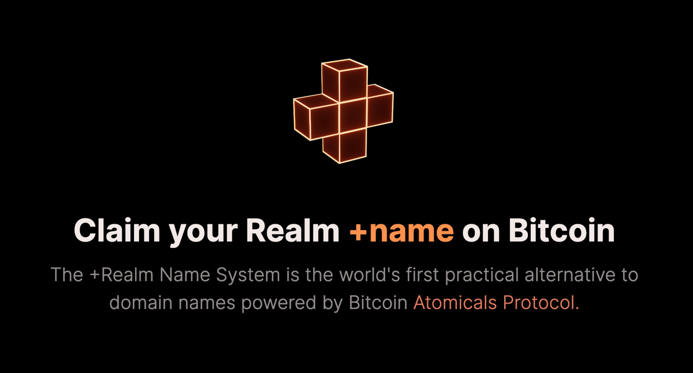
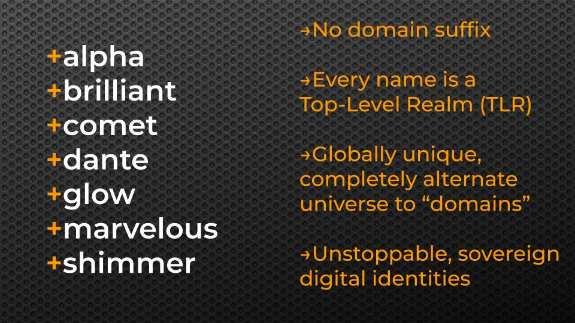

# 简介

领域数字对象概述（领域名称服务）

本节介绍了如何铸造一种称作领域的特殊 Atomical 数字对象。领域名称可以在 https://realm.name 网站上进行查询和搜索。


<div style={{ textAlign: 'center',fontStyle:'italic' }}>
在比特币区块链上申领你的领域名称 +name https://realm.name
</div>

import Admonition from '@theme/Admonition';

<Admonition type="info" icon="" title="➡️ 什么是领域？">
领域名称是一种人类可读的标识符，用于关联网络地址和资源信息。领域名称以加号 `+` 为前缀，并至少包含一个字母字符，如 `+alice` 和 `+agent007` 都是领域名称系统（RNS）中的有效顶级领域（TLRs）。领域名称通过 Atomicals 数字对象格式在比特币区块链上实现自我所有权和自我管理——这意味着不存在中间方或中央注册机构的介入。一旦您注册了一个领域名称，它就永久属于您，除非您决定将其转移给他人。
</Admonition>



## 铸造领域

在执行以下命令之前，您需要先通过 `wallet-init` 命令创建一个本地钱包，以便顺利进行后续操作。

**第一步：下载并安装 atomicals-js 命令行工具**

请下载并安装[atomicals-js](https://github.com/atomicals/atomicals-js)命令行工具。

```bash showLineNumbers
git clone https://github.com/atomicals/atomicals-js.git
cd atomicals-js
npm install
npm run build
```

**第二步：初始化钱包**

钱包的主要作用是创建支付到 Taproot（P2TR）的消费脚本，并用于接收各种操作交易的找零。_请注意，目前这还处于测试阶段，因此请勿投入超出您可承受范围的资金。_

为了初始化一个新的 `wallet.json` 文件，该文件将用于存储接收找零的地址，请运行 `wallet-init` 命令。

```bash showLineNumbers
# highlight-next-line
npm run cli wallet-init

>>>

Wallet created at wallet.json
phrase: maple maple maple maple maple maple maple maple maple maple maple maple
Legacy address (for change): 1FXL2CJ9nAC...u3e9Evdsa2pKrPhkag
Derive Path: m/44'/0'/0'/0/0
WIF: L5Sa65gNR6QsBjqK.....r6o4YzcqNRnJ1p4a6GPxqQQ
------------------------------------------------------
```

**第三步：铸造领域**

使用 [Atomicals 命令行工具](https://docs.atomicals.xyz/reference-and-tools/javascript-library-cli) 铸造一个领域名称的基本格式是：

```bash showLineNumbers
# highlight-next-line
npm run cli mint-realm "myrealmname"

Optional flags:
--satsbyte=<number>
```

领域铸造命令 `mint-realm` 允许您铸造领域 `myrealmname`，条件是您是首位申领者。

按照屏幕上的指示完成支付和铸造步骤。

**必需参数：**

- _realmname_：领域的全球唯一名称。

**可选参数：**

- `--satsbyte=<number>`：设定每字节所需支付的矿工费用（单位为聪），此参数将覆盖默认值。（注：关于交易矿工费的实际数值，请参考[mempool.space](https://mempool.space/)）

**第四步：查询领域名称**

您需要等待 3 个区块的确认，以确保领域名称被正确申领和注册。一旦领域名称成功注册，您可以通过以下命令查询该领域名称：

```bash showLineNumbers
npm run cli get +myrealmname
```

您还可以通过访问 https://realm.name 来查询和搜索领域名称。

**第五步：查询全球 Feed（可选）**

您可以通过以下命令查询已注册领域和 Atomicals 的全球 feed：

```bash showLineNumbers
npm run cli list
```

<Admonition type="tip" icon="" title="⚡开始铸造您的第一个 Atomical 数字对象">
[下载并安装 Atomicals JavaScript 命令行工具](https://github.com/atomicals/atomicals-js)，并按照快速入门指南进行操作，在不到 2 分钟内铸造您的 NFT、集合或领域名称。
</Admonition>
