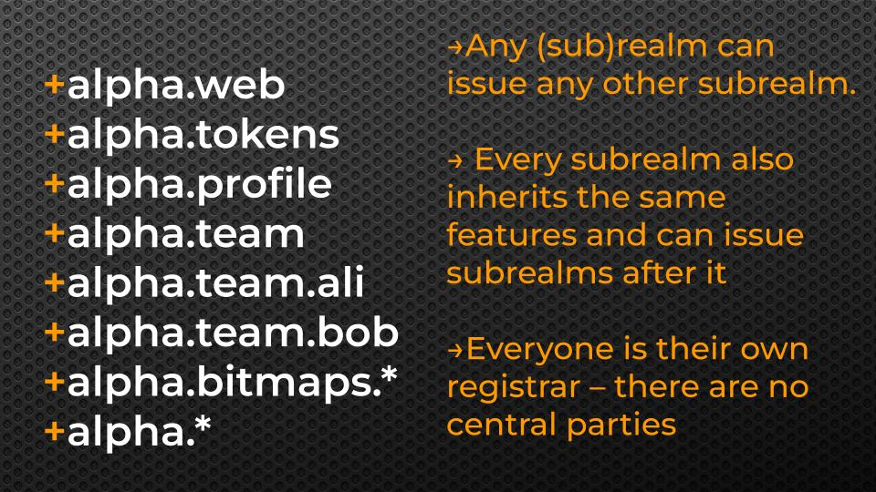

# 铸造子领域

每个领域及其子领域都可以支持在其下铸造任意数量的子领域。



## 方法 1：使用子领域规则铸造

用户可以通过在领域或子领域的数据结构内部的子领域命名空间中设定铸造规则，从而铸造子领域。接下来，我们将展示如何配置一个领域（或子领域），以便用户能够自行铸造子领域。我们将以 `+mycoolrealm` 这个示例领域名称为起点，说明启用子领域铸造功能所需的各个步骤。

### 先决条件

* 您已经认领了一个领域或子领域。
* 您已经考虑清楚了允许用户铸造子领域的具体方式（我们将在下文提供更多细节）。

### 第一步：创建初始子领域铸造规则文件

有关规则文件格式的详细信息，请参考[规则指南](../rules-subrealms-and-dmint.mdx)。接下来，我们将通过配置示例规则来展示如何为示例领域 `+mycoolrealm` 设置规则。

该示例领域 `+mycoolrealm` 位于测试网络上，其 `atomical_id` 为 `285051d51bb9d045d24dc0816d6f29bfe72b1c91e479702ec866c724a0f4aa56i0`。

**示例规则文件（保存为 `rules.json`）**

```json showLineNumbers
{
  "subrealms": {
    "rules": [
        {
          "p": "^[a-z0-9]{6,64}$",
          "bitworkc": "8888.8"
        },
        {
          "p": ".*",
           "o": {
            "5120ed2ec645d1749c9b2dba88b1346899c60c82f7a57e6359964393a2bba31450f2": {
              "v": 1000
            }
          }
        }
    ]
  }
}
```

上述规则文件使得任何人都可以免费铸造长度在 6 到 64 个字符之间的子领域，前提是用户通过使用 `"bitworkc": "8888.8"` 的[Bitwork](../bitwork-mining.mdx)（大约需要 1-2 分钟的CPU时间）来铸造子领域。此外，还有第二条规则，允许用户铸造长度少于 6 个字符的子领域，条件是向地址 `bc1pa5hvv3w3wjwfktd63zcng6yeccxg9aa90e34n9jrjw3thgc52reqxw6has` 支付 10,000 聪（这里的 `5120ed2ec645d1749c9b2dba88b1346899c60c82f7a57e6359964393a2bba31450f2` 是输出脚本的十六进制格式）。

这个地址是通过以下命令从输出脚本转换得到的。

```bash showLineNumbers
yarn run cli script-address 5120ed2ec645d1749c9b2dba88b1346899c60c82f7a57e6359964393a2bba31450f2
```

记住，您可以借助命令行工具来在输出脚本的十六进制格式和地址之间进行转换。更多详细信息，请参考[规则指南](../rules-subrealms-and-dmint.mdx)。

### 第二步：为您的领域启用 “enable-subrealms” 铸造规则

根据您在第一步中创建的规则文件，我们将为您的特定领域启用子领域铸造功能。

请使用命令行工具，并执行以下命令来启用子领域的铸造：

```bash showLineNumbers
yarn cli enable-subrealms +mycoolrealm file.json --satsbyte=100
```

接下来，根据屏幕上的指示向您的资金地址存入资金。一旦交易得到确认，您设定的规则就会生效，届时任何人都能够依照您设定的规则来铸造子领域。

### 第三步：使用“realm-info”查询以查看已激活的规则

在第二步的交易成功完成且至少有 1 个区块确认之后，您可以通过以下命令来查询您领域中已激活的规则：

```bash showLineNumbers
yarn cli realm-info mycoolrealm
```

该命令将展示有关您的领域及其激活规则的详细信息。

:::info

⭐ **祝贺您！您已在您的领域或子领域中成功启用了子领域的铸造功能。** 继续阅读以下内容，以了解用户如何参与并认领子领域。

:::

### 铸造和认领子领域

遵循上述创建的规则，用户可以铸造和认领子领域。通过以下命令，用户能够查询子领域名称的可用性，确认适用的铸造规则，并查看他们请求的状态。

**第一步：查询想要认领的子领域以检查其可用性**

查询子领域 `+mycoolrealm.nicesubrealm`，以确认它是否未被占用且可用。使用命令 `realm-info` 查询，这与DNS中的 `WHOIS` 命令功能类似，提供关于领域名称的相关信息。

```bash showLineNumbers
yarn cli realm-info mycoolrealm.nicesubrealm
```

**第二步：提交子领域铸造请求**

```bash showLineNumbers
yarn cli mint-subrealm +mycoolrealm.nicesubrealm --satsbyte=100
```

接着按照屏幕上的提示进行操作。如果铸造过程中需要支付费用，您需要使用支持支付功能的工具来完成。

**第三步：（如需支付）在指定的支付时间内完成对子领域的支付**

命令行工具提供了功能，允许查看哪些子领域正等待接收付款，并支持您通过标准比特币聪来完成支付：

```bash showLineNumbers
yarn cli pending-subrealms
```

接着根据屏幕上的提示完成支付。

:::warning

不建议使用命令行工具来支付高价值的项目或者使用 ARC20 代币进行支付。该工具仍处于试验阶段，除非您具有高级用户的经验，否则不推荐使用。最佳做法是等待支持付款流程的钱包发布，以简化支付流程。

:::
